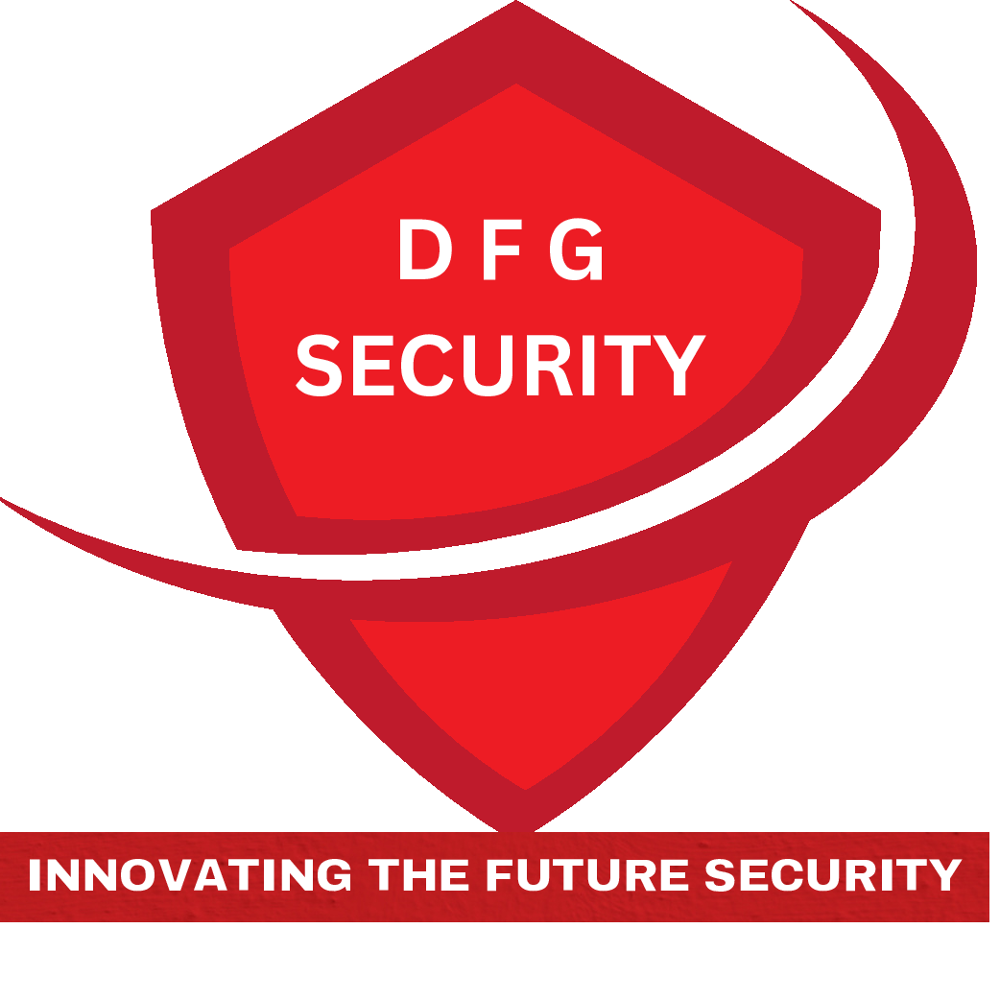

# 🛡️ Dee Security Ltd Website

This repository contains the source code for **Dee Security Ltd's official website**, built with **React.js**.  
A responsive, modern, and interactive platform to showcase the company's services and connect with clients and potential employees.



---

## 📌 Overview

**Dee Security Ltd** is a UK-based professional security provider.  
This website highlights their offerings, provides essential company information, and includes an application portal for job seekers.

---

## 🚀 Features

- ✅ **Responsive Design** – Mobile, tablet, and desktop-friendly layout
- 🎨 **Modern UI** – Smooth transitions, animations, and interactive elements
- 📝 **Job Application Form** – With validation and easy-to-use interface
- 🌐 **Social Media Integration** – Linked icons for extended reach
- 💡 **Modular Components** – Reusable and clean codebase

---

## 🗂️ Project Structure

```plaintext
src/
├── component/
│   ├── floating.js/.css       # Animated service banners
│   ├── footer.js/.css         # Footer with contact and legal info
│   ├── form.js/.css           # Job application form
│   ├── logo.js                # Animated company logo
│   ├── navbar.js/.css         # Responsive navbar
│   ├── social-icon.js         # Social links
│   └── text.js/.css           # Reusable text components
│
├── pages/
│   ├── about.js/.css          # About us page
│   ├── career.js/.css         # Job listings and form
│   ├── contact.js/.css        # Contact and location info
│   ├── home.js/.css           # Landing page
│   └── new.js/.css            # News, testimonials
│
└── App.js                     # Root React component
🎨 Design Features
🎨 CSS Variables for consistent styling

🌀 Framer Motion animations for smooth UX

📱 Responsive Layout using Flexbox & Grid

🟦 Bootstrap-like Styles with custom theming

✨ Hover Effects and Transitions

🛠️ Installation & Setup
1. Clone the repository
bash
Copy
Edit
git clone https://github.com/yourusername/dee-security-website.git
cd dee-security-website
2. Install dependencies
bash
Copy
Edit
npm install
3. Run the development server
bash
Copy
Edit
npm start
4. Build for production
bash
Copy
Edit
npm run build
🧩 Dependencies
React – UI framework

React Router DOM – Routing between pages

Framer Motion – Animations

Font Awesome – Iconography

React Icons – Social and UI icons

📱 Responsive Design
Breakpoints and layout behaviors:

Device	Width	Behavior
Mobile	< 768px	Stacked layout, toggled nav
Tablet/Desktop	≥ 768px	Horizontal layout, expanded UI

📄 Page Descriptions
Page	Description
🏠 Home	Introduction to Dee Security and quick access links
🧾 About	Company history, values, and certifications
💼 Career	Job openings and interactive application form
📞 Contact	Contact details, address, and social media
📰 News	Testimonials and latest updates

🧩 Key Components
Floating Text – Eye-catching animated service banners

Navbar – Responsive top nav with collapsible mobile menu

Application Form – Validated input fields with smooth UX

Footer – Contact, navigation, and licensing info

Social Icons – Direct links to platforms like Facebook, LinkedIn, etc.


📜 License
Licensed under the MIT License.

📞 Contact
For questions or support, email us at:
📧 info@deesecurity.com

© 2025 Dee Security Ltd. All Rights Reserved.
